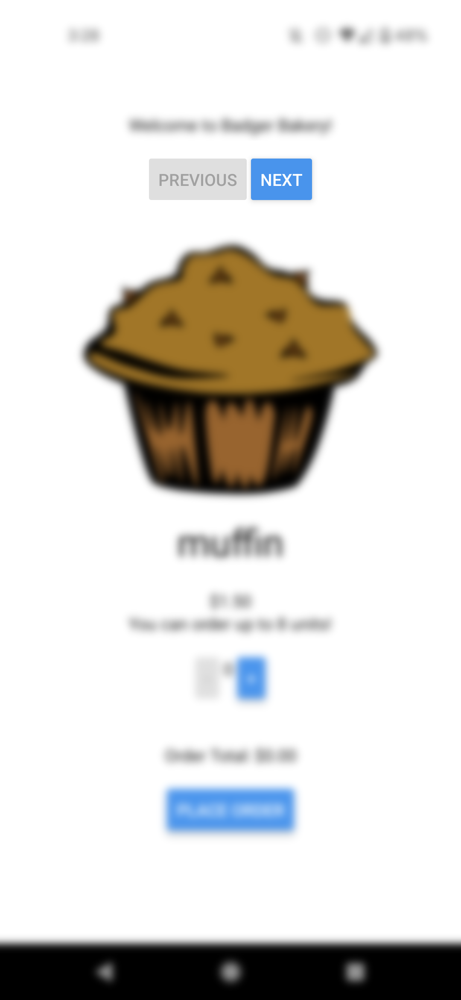
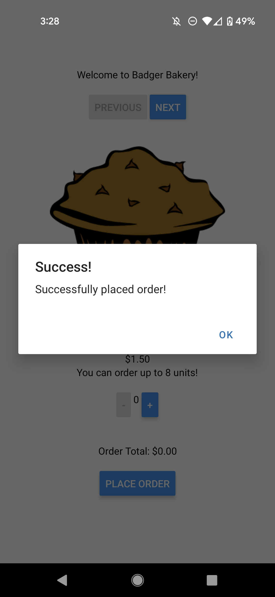

# CS571 HW6: Badger Bakery

Welcome to Badger Bakery! For this assignment, you will complete a mobile application that allows badgers to order from their favorite bakery (BadgerBakery) online using just a few taps on their phone! This assignment works with a *real* API. Please be mindful about how many orders you place, we are a a small town bakery and would prefer not to be flooded with orders.

Following, you will answer questions related to mobile design.  **Make sure to complete both parts of this assignment.**


## Badger Bakery

The starter code provided to you was generated using [expo](https://expo.dev/), therefore the "boilerplate" code has already been generated. **You should *not* re-run the expo init command**. Instead, in this directory, simply run...

```bash
npm install
npm start
```

To test your app, you have a few options. If you have a smart device, I would recommend using the expo app for [iOS](https://apps.apple.com/us/app/expo-go/id982107779) or [Android](https://play.google.com/store/apps/details?id=host.exp.exponent&hl=en_US&gl=US). You can scan the QR code using your phone, or you can launch commands via the terminal. Otherwise, you can use an emulator (such as [AVD](https://developer.android.com/studio/run/emulator)). Do not use the web browser to test your code; you must test on Android or iOS!

Note that we are writing code in JavaScript for React Native; if you begin writing code in Objective-C, Swift, Java, or Kotlin you are likely doing something *very* wrong!

### API Notes

All data can be retrieved via API calls to `https://www.coletnelson.us/cs571/f22/hw6/api/`. A brief overview of the API is provided below. Please refer to `API_DOCUMENTATION.md` for details.

All routes are relative to `https://www.coletnelson.us/cs571/f22/hw6/api/`

| Method | URL | Purpose | Return Codes |
| --- | --- | --- | --- |
| `GET`| `/bakery/items` | Get all bakery items with their associated name, price, image url, and upper bound order limit. | 200, 304 |
| `GET` | `/bakery/images/:itemName`| Get the image for the specified item. | 200, 304, 404 |
| `GET` | `/bakery/order` | Get the most recent orders. | 200, 304 |
| `POST` | `/bakery/order` | Make an order. | 200, 400, 401, 413 |

**When making API calls with a request body, don't forget to include the header `"Content-Type": "application/json"`**

### Other Special Note

In this and following homeworks, we are using our existing knowledge of ReactJS and applying it to mobile devices. As such, they will be *much* more open-ended. Unless stated otherwise, any components, contexts, or functions made for you are merely *suggestions*, you may choose how to build your own app as long as it meets the requirements of the assignment!

### 1. Display Baked Goods

Fetch the baked goods from `https://www.coletnelson.us/cs571/f22/hw6/api/bakery/items` and display them to the screen, including their name, image, price, and how many can be ordered. I'd recommend storing all baked goods as a state variable in `BadgerBakery` and presenting them as a child component called `BadgerBakedGood`. Don't forget to specify a unique `key` for each baked good!


### 2. Navigate Between Baked Goods

Instead of showing all baked goods on the same screen, add "Previous" and "Next" buttons to allow the user to navigate between baked goods. The "previous" button should be disabled when viewing the first baked good, and the "next" button should be disabled when viewing the last baked good. You can disable buttons [by adding a `disabled` property](https://reactnative.dev/docs/button). I'd recommend adding a currIndex variable in `BadgerBakery` to track which item the user is currently viewing.




### 3. Add and Remove from Basket

Allow the user to add and remove items from their basket via "+" and "-" buttons. The "-" button should be disabled when the user has 0 of that item in their basket, and the "+" button should be disabled when the user has reached the `upperBound` of that item.

I'd recommend using a context such as `BadgerOrderContext` that contains how many baked goods are in a user's basket. This context may hold an object that looks like...

```javascript
{
    muffin: 3,
    donut: 0,
    pie: 1,
    cupcake: 0,
    croissant: 2
}
```

... where the value of each item is modified when it has been added/removed from the basket.


### 4. Show Order Total

The total cost of the items in the users' basket should be shown.


### 5. Submit Order

The user should be able to submit their order by pressing a "place order" button. Before placing an order, you should confirm that the user has *something* in their basket, otherwise tell them that their basket is empty. To order, you will do a `POST` to the API with the contents in the user's basket. You will also need to hardcode your `refCode` as a part of the request body.

If there is an error with a request, you should tell the user "Something went wrong!" otherwise tell the user "Successfully placed order!". To quickly do this, you can [use React Native alerts](https://reactnative.dev/docs/alert). After the order has been successfully submitted, you should clear the user's basket.




### Other Notes
You may assume that each bakery item has a unique `name` as well as a `price`, `img`, and `upperBound`. You should use `toFixed(2)` to format the price/total of any monetary amounts. However, you may *not* hardcode the use of "muffin", "donut", "pie", "cupcake", or "croissant"! Being a busy bakery in Madison, the items we sell may vary from day-to-day, and we should *not* assume we will always be selling these same items.

You can verify that the order has hit the API and has been placed in the database by doing a GET to `https://www.coletnelson.us/cs571/f22/hw6/api/bakery/order` via your browser or Postman. You do *not* need to show the user all of the recent orders, this is simply for you to verify that it has reached the backend.

### Submission Details
In addition to your code, **you will also need to submit a video recording of your app**. Like the demo video, it should cover all the tasks below. Please thoroughly demonstrate all tasks to showcase the capabilities of your app.

**Please embed your recording as a [Kaltura video](https://learning.kaltura.com/media/How+to+Embed+a+Kaltura+Media+in+the+Context+of+a+Canvas+Course/0_4weol2uv) as a part of the assignment submission.**

#### Tasks 
 - Navigate between *all* baked good items.
 - Add to the basket both the lower and upper bound of each baked good.
 - Try to submit an order with *no* baked goods.
 - Submit an order with *some* baked goods.

___

## Mobile Design

The questions below will ask you about the design of the Badger Bakery app that you had just implemented. For each question, please write a response grounded in content from the "Mobile Design" lecture or other reputable sources.

1. Consider the layout of your app. Are any of your user input components "hard to reach"? If so, what is the potential impact on users and how would you remedy this?

INSERT YOUR RESPONSE HERE.

2. Choose 2 "gestures" that could improve the usability of your app. Define what these gestures are, what they would do, and how they would improve the usability of your app.

INSERT YOUR RESPONSE HERE.

3. Describe a microinteraction that was implemented in Badger Bakery. What is that microinteraction, what is its trigger, and what feedback does it provide to the user?

INSERT YOUR RESPONSE HERE.
